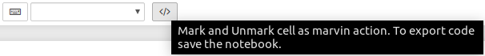
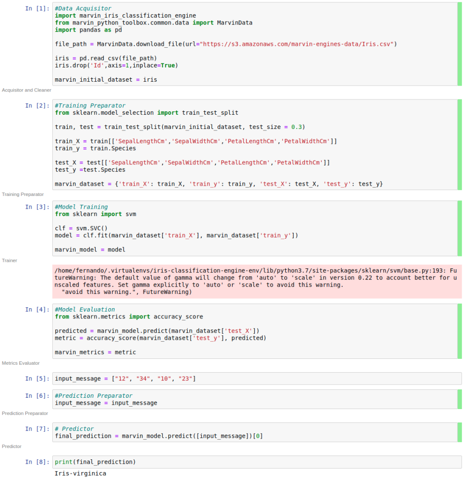

.. _Create:

============================
Creating a New Engine
============================

In this section are examples of how to create and work with an engine.

1. To create a new engine::

    $ workon python-toolbox-env
    $ marvin engine-generate

Respond the interactive prompt and wait for the engine environment preparation, and don’t forget to start dev box before if you are using vagrant.

2. Test the new engine::

    $ workon <new_engine_name>-env
    $ marvin

    
3. For more informations::

    $ marvin --help

4. Youtube Tutorial

.. raw:: html

    <iframe width="560" height="315" src="https://www.youtube.com/embed/p7yiLh2uLlQ" frameborder="0" allowfullscreen></iframe>

Creating a Iris Flower Classification Engine example
------------------------------------------

Tutorial for creating an example of the Iris flower classification task on Marvin without using the ready-made engines.

Requeriments
~~~~~~~~~~~~~~~

* Python 3.7.3
* Pandas 0.25.0
* Scikit-learn 0.21.3

Getting started
~~~~~~~~~~~~~~~~

First, create a new engine for this project. If you don’t know how, access :ref:`Create`.

The engine was named “iris-classification”.

.. image:: ../images/iris-create-engine.png

Now, to be able to work on the project, use the following command::

    $ workon iris-classification-engine-env

You are now ready to code.

.. raw:: html

    

.. role:: red

Note: If the workon command "does" not work, type :red:`source ~/.bash_profile` and try running the command again.

Running tests
~~~~~~~~~~~~~~~~

This project uses py.test_ as test runner and Tox_ to manage virtualenvs.

.. _py.test: http://pytest.org
.. _Tox: https://tox.readthedocs.io

To run all tests use the following command::

    $ marvin test

Writting documentation
~~~~~~~~~~~~~~~~~~~~~~~~

The project documentation is written using Jupyter notebooks. You can start the notebook server from the command line by running the following command::

    $ marvin notebook

The notebook is accessed by the browser using the address :red:`localhost:8888`.

**You need to organize the code into cells so that each corresponds to one action of  the Marvin-AI Design Pattern DASFE.** :ref:`dasfe`

**Note that at the end of each cell there is a reserved variable named “marvin_”, those variables will be responsible for creating the artifacts which will be persisted. Also note that you need to import the libraries that will be used in each corresponding cell.**

First, you need to load the dataset. This cell it’s the *Acquisitor and Cleaner*.

.. code-block:: python

    #Data Acquisitor
    import marvin_iris_classification_engine
    from marvin_python_toolbox.common.data import MarvinData
    import pandas as pd

    file_path = MarvinData.download_file(url="https://s3.amazonaws.com/marvin-engines-data/Iris.csv")

    iris = pd.read_csv(file_path)
    iris.drop('Id',axis=1,inplace=True)

    marvin_initial_dataset = iris

In the next cell we split the dataset to prepare for training. This cell it’s the *Training Preparator*.

.. code-block:: python

    #Training Preparator
    from sklearn.model_selection import train_test_split

    train, test = train_test_split(marvin_initial_dataset, test_size = 0.3)

    train_X = train[['SepalLengthCm','SepalWidthCm','PetalLengthCm','PetalWidthCm']]
    train_y = train.Species

    test_X = test[['SepalLengthCm','SepalWidthCm','PetalLengthCm','PetalWidthCm']]
    test_y = test.Species

    marvin_dataset = {'train_X': train_X, 'train_y': train_y, 'test_X': test_X, 'test_y': test_y}

Next is the model training. In this tutorial we used a Support Vector Machine (SVM), but you can use the algorithm of your choice. This phase is the *Trainer*.

.. code-block:: python

    #Model Traning
    from sklearn import svm

    clf = svm.SVC()
    model = clf.fit(marvin_dataset['train_X'], marvin_dataset['train_y'])

    marvin_model = model

Here we evaluate model performance utilizing prediction accuracy. This is the *Metrics Evaluator*.

.. code-block:: python

    #Model Evaluation
    from sklearn.metrics import accuracy_score

    predicted = marvin_model.predict(marvin_dataset['test_X'])
    metric = accuracy_score(marvin_dataset['test_y'], predicted)

    marvin_metrics = metric

The following message does not enter the DASFE Architecture, we use this for tests purposes while coding in the notebook.  Therefore, it will be placed in an isolated cell and will not receive any markup.

.. code-block:: python

    input_message = ["12", "34", "10", "23"]

In this cell occurs the reading and transformation of the message which will be further passed to the predictor. In this case, since there is no need to apply any treatment to the input message, the message is already prepared, thus we do not modify variable input_message. This is the *Prediction Preparator*.

.. code-block:: python

    #Prediction Preparator
    input_message = input_message

The following cell performs the prediction, being the end result. This stage is the *Predictor*.

.. code-block:: python

    # Predictor
    final_prediction = marvin_model.predict([input_message])[0] 

Like on the test message, this cell does not enter the DASFE Architecture. This cell is only for checking the result within the notebook itself.

.. code-block:: python

    print(final_prediction)

Mark cells on DASFE Architecture
~~~~~~~~~~~~~~~~~~~~~~~~~~~~~~~~~~~

To apply mark cells, use the drop-down menu at the top of the Jupyter notebook as illustrated below.

Once the markup is done, the code should look like this:

If everything is correct, save the changes and quit Jupyter Notebook.

Running the Dryrun
~~~~~~~~~~~~~~~~~~~~

Marvin dryrun is a way to test your code against DASFE standards.

**By default, a String message is sent to dryrun, but because the Iris Classification message should be a list of four numbers (flower characteristics), you must change it to be compatible.**

**In order to do this, access the engine.messages file inside the folder** :red:`../marvin/iris-classification-engine/`

The default message should look like this::

    [{
    	"msg1": "Hello from marvin engine!"
    }]

Delete the original content and input the following message::

    [[1,2,3,4]]

Now it is possible to perform dryrun correctly. At the terminal, type the following command::

    $ marvin engine-dryrun

Http Server
~~~~~~~~~~~~~~~~

After executing dryrun without any error raised, it’s possible to generate the project API. Use the following command::

    $ marvin engine-httpserver

The server is accessed by the browser using the address :red:`localhost:8000/docs`.

To test the API, go to *Predictor*, click in *Post*, then in *Try it out*, enter the message and click on *Execute* as in the image below.

.. image:: ../images/predictor.png

Test message for this example::

    {"message": ["4.8", "3.4", "1.9", "0.2"]}
