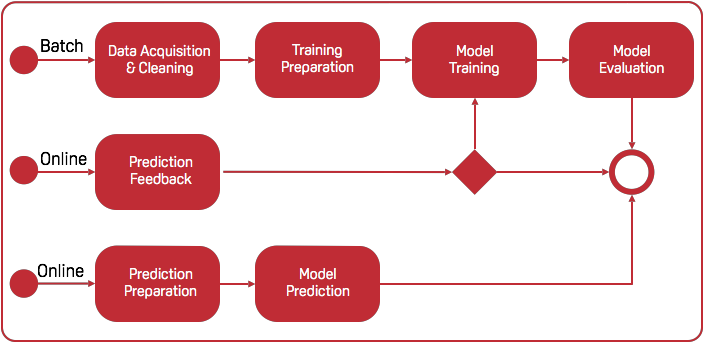

.. _main-components:

============================
Main Components
============================

In this section, we explain the design pattern for Apache Marvin-AI.

.. _dasfe:

DASFE
--------------

The DASFE design pattern stands for Data Acquisition, Selection, Feedback and Evaluation. In Marvin, the DASFE pattern is represented by the image below. Each box, which we call an Action, holds code written by the user.

